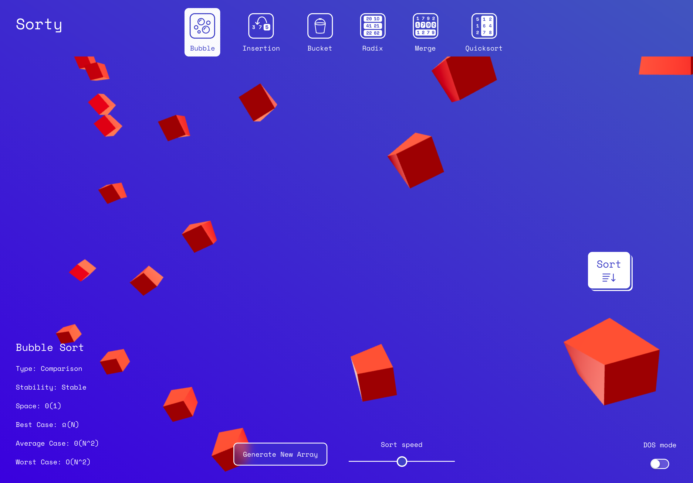

# Sorty!

Welcome to Sorty, your friendly neighbourhood sorting method visualiser :)

This was a personal goal of mine, to learn more about the way the different sorting methods function and then from there, how to show how they do their thing. It's not a new idea of course, though I felt it was an exercise I wanted to explore.

Visit Sorty at [sorty.dev](https://sorty.dev)!

## Features

Sort the array of cubes using the sort method of your choosing. See how the different sorting algorithm types sort data and see their respective time and space complexities in the bottom left alongside their best, worst and average case scenarios for each. Adjust the speed to taste. 🏃🏼

For a little extra fun, try toggling from DOS mode into Atari mode. 🕹👀

## The Stack 🥞

React was used for this project, another exercise I wanted to try particularly with threejs which was the framework used for the three dimensional elements.

With a sprinkling of Node and some good old fashioned sorting methods, Sorty was born.

The bubble (Adrien Coquet) and bucket (Nociconist) icons were sourced from The Noun Project.

### threejs 📦

This was the first exposure I had to threejs

## Special Mentions 🗣

A huge thank you to Joel, Guillaume and Stacey for all the help on this one from the GA crew. They really guided at the pertinent points, and I'm so grateful for this. Guillaume in particular smashed it out of the park with the array storage method guidance which was inspired.

Shout out to Andre and Aron for also supporting me particularly in the land of React - you guys are wizzes.
